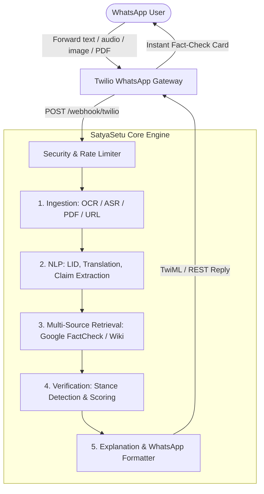

# SatyaSetu (सत्यसेतु) 🛡️
### AI-Powered Multi-Modal Fact-Checking Engine for WhatsApp

> **SatyaSetu** ("Bridge of Truth") is an automated, production-grade misinformation verification engine built to combat viral fake news, rumors, and manipulated media on WhatsApp in real time. It processes multi-modal forwards (Text, Screenshots, Voice notes, PDFs, URLs), isolates check-worthy claims, queries authoritative fact-checking databases, analyzes stance and entailment using NLI, and delivers clear, multi-lingual WhatsApp verifications in seconds.

[](https://www.python.org/)
[](https://fastapi.tiangolo.com/)
[](tests/)
[](app/core/security.py)
[](Dockerfile)

---

## 🌟 Key Capabilities

- **🎙️ Multi-Modal Ingestion Pipeline**:
  - **Text & Links**: Automatic extraction, link scraping with article body parsing, and OpenGraph fallbacks.
  - **Screenshots & Memes**: OCR text extraction via EasyOCR.
  - **Voice Notes & Audio**: Speech-to-text transcription via OpenAI Whisper with multi-lingual audio normalization.
  - **Documents (PDF)**: PyMuPDF extraction with OCR fallback for scanned multi-page documents.
- **🌐 Multilingual Intelligence**:
  - Language identification across Indian languages (Hindi, Bengali, Tamil, Telugu, Marathi, etc.) using fastText LID.
  - Neural machine translation with conditional M2M100 models and rule-based fallbacks.
- **🔍 Multi-Source Evidence Retrieval (RAG)**:
  - **Google Fact Check Tools API**: Matches against certified IFCN fact-checkers (AltNews, BoomLive, Vishwas News, Factly, etc.).
  - **Wikipedia API**: Real-time contextual background verification.
  - **Trusted Web Search**: Domain-whitelisted search aggregator.
- **⚖️ NLI Stance Detection & Credibility Scoring**:
  - Natural Language Inference (NLI) evaluating entailment, contradiction, and neutral stance.
  - Multi-tier verdict scoring: `TRUE`, `MOSTLY_TRUE`, `MISLEADING`, `FALSE`, `UNVERIFIABLE`.
- **📱 WhatsApp-Native Formatting**:
  - Concise bulleted summaries, credibility bars, source links, and clear disclaimers formatted specifically for WhatsApp chat bubbles.
- **🔒 Enterprise-Grade Security & OWASP Hardening**:
  - **Rate Limiting**: In-memory sliding-window limiter per user and IP with graceful 429 status and retry headers.
  - **SSRF Defense**: Strict URL validation blocking private RFC-1918 subnets, loopback addresses, AWS metadata endpoints (`169.254.169.254`), and non-HTTP protocols.
  - **Input Sanitization**: Zero-byte stripping, control character removal, strict length truncations, and Pydantic v2 validation.
  - **Credential Safety**: Zero hardcoded secrets; 100% environment-driven configuration.

---

## 🏗️ Architecture



---

## 📁 Repository Structure

```
SATYASETU/
├── app/                               # Production Modular Application
│   ├── contracts/                     # Canonical Pydantic schemas & enums
│   │   └── models.py                  # Claim, Evidence, Verdict, VerificationResult
│   ├── core/                          # Core foundational utilities
│   │   ├── config.py                  # Pydantic Settings & environment variables
│   │   ├── logging.py                 # Structured logging
│   │   ├── redaction.py               # Phone & PII SHA-256 masking
│   │   ├── security.py                # Rate limiting, SSRF guard, input sanitization
│   │   └── timing.py                  # High-precision stage latency timers
│   ├── features/                      # Modular functional domain pipelines
│   │   ├── ingestion/                 # ASR, OCR, PDF, URL, and media detection
│   │   ├── nlp/                       # LID, translation, claim extraction & worthiness
│   │   ├── retrieval/                 # Google FactCheck, Wikipedia, Web sources & ratings
│   │   ├── verification/              # NLI stance detection, credibility scoring & aggregation
│   │   └── explanation/               # Plain-language generator & WhatsApp formatter
│   ├── routers/                       # FastAPI route controllers
│   │   ├── health.py                  # GET /health probe
│   │   └── webhook.py                 # POST /webhook/twilio endpoint
│   └── pipeline.py                    # Master orchestrator connecting all 5 stages
├── legacy/                            # Archived pre-refactoring prototypes (Waves 1-3)
├── scripts/
│   └── demo_cli.py                    # Interactive standalone fact-checking CLI demo
├── tests/                             # Comprehensive Automated Test Suite (183 Tests)
│   ├── abuse/                         # Rate limiting & SSRF attack tests
│   ├── fixtures/                      # Test sample payloads
│   ├── integration/                   # End-to-end integration and smoke tests
│   └── unit/                          # Unit tests for contracts, NLP, retrieval, etc.
├── app_main.py                        # Modern FastAPI application instance
├── main.py                            # Unified application entry point
├── Dockerfile                         # Production multi-stage Docker build
├── Procfile                           # Web dyno deployment specification
└── requirements.txt                   # Production dependencies
```

---

## ⚡ Quick Start

### 1. Prerequisites
- Python 3.11+
- Virtual environment tool (`venv` or `uv`)

### 2. Setup Virtual Environment
```bash
# Clone the repository
git clone https://github.com/shreyaaspires-cloud/SatyaSetu.git
cd SatyaSetu

# Create and activate virtual environment
python -m venv .venv
# On Windows:
.venv\Scripts\activate
# On Linux/macOS:
source .venv/bin/activate

# Install dependencies
pip install -r requirements.txt
```

### 3. Environment Configuration
Copy `.env.example` to `.env` and provide your API keys:
```bash
cp .env.example .env
```
Key variables:
- `TWILIO_ACCOUNT_SID` and `TWILIO_AUTH_TOKEN`: For WhatsApp messaging.
- `FACT_CHECK_API_KEY`: Google Fact Check Tools API key.
- `GEMINI_API_KEY`: (Optional) For advanced LLM summary generation.

### 4. Running the Web Server
Launch the server using either entry point:
```bash
uvicorn main:app --reload --port 8000
# OR
uvicorn app_main:app --reload --port 8000
```
Visit `http://localhost:8000/docs` for the interactive Swagger documentation.

---

## 🖥️ Interactive CLI Demo

Test the end-to-end verification pipeline directly from your terminal without needing Twilio:

```bash
# Check an English viral claim
python scripts/demo_cli.py --claim "Drinking bleach cures viral infections within 24 hours."

# Check a Hindi viral claim
python scripts/demo_cli.py --claim "नींबू पानी पीने से कैंसर ठीक हो जाता है"
```

Sample output:
```
============================================================
 🛡️  SATYASETU FACT-CHECK DEMO
============================================================
📥 Input Claim : Drinking bleach cures viral infections within 24 hours.
------------------------------------------------------------
🌐 Detected Language : en
⚖️  Overall Verdict   : FALSE
⏱️  Pipeline Latency  : 1.12s
------------------------------------------------------------
📱 WhatsApp Formatted Reply Received By User:
============================================================
🔍 *SatyaSetu Fact Check*
─────────────────────────
*Claim:* Drinking bleach cures viral infections within 24 hours
❌ *FALSE* (96% confidence)

• *Fact-Checked by BOOM Live*: Drinking chlorine dioxide or bleach is toxic and does not treat viral disease.
• *Source Link*: https://boomlive.in/...
─────────────────────────
_SatyaSetu — AI-powered multilingual fact checking_
============================================================
```

---

## 🧪 Testing & Verification

SatyaSetu comes with an automated test suite containing **183 tests** covering unit behavior, integration pipelines, abuse cases, and characterisation regression:

```bash
# Run all 183 tests
pytest tests/ -q

# Run abuse and security tests
pytest tests/abuse/ -v

# Run smoke integration tests
pytest tests/integration/ -v
```

---

## 🐳 Docker Deployment

Build and run the containerized application:

```bash
# Build Docker image
docker build -t satyasetu:latest .

# Run container
docker run -p 8000:8000 --env-file .env satyasetu:latest
```

---

## 📜 License & Acknowledgments

Built for **Hack on Track**. Dedicated to building reliable, accessible truth-infrastructure for everyone.
